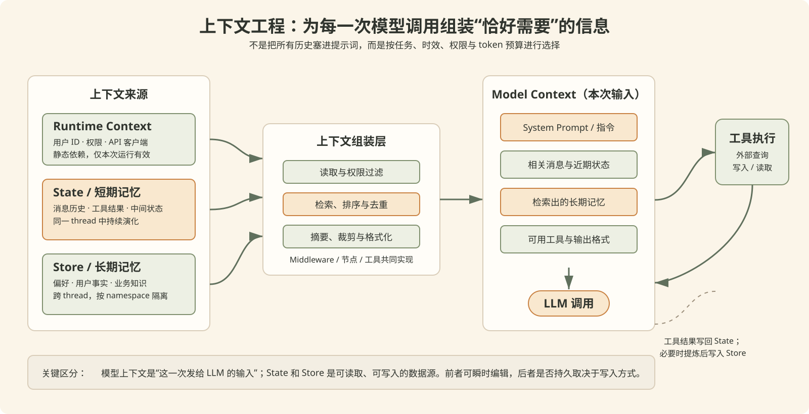
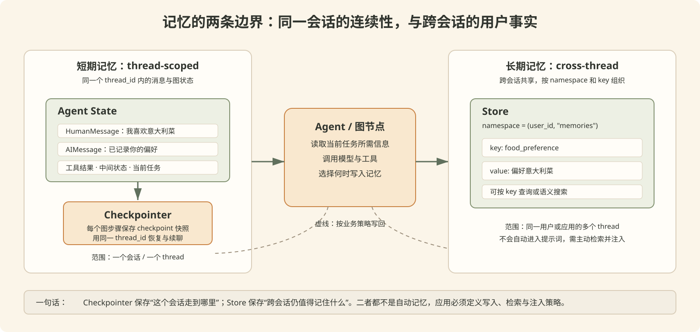

# 上下文与记忆

> 本章先建立一张总图：**上下文工程**解决“这一刻应把什么交给模型”，**记忆**解决“哪些信息应在未来仍可被找回”。后续目录中的 Runtime Context、短期记忆和长期记忆会分别展开实现细节。

## 1. 从 Context Window 到上下文工程

### 1.1 三个容易混淆的概念

| 概念 | 含义 | 关注点 |
| --- | --- | --- |
| Context Window（上下文窗口） | 模型一次最多可接收或处理的 token 容量 | 上限有多大 |
| Model Context（模型上下文） | 本次请求真正发送给模型的输入，如系统提示词、相关消息、工具、检索结果与输出格式 | 这一轮让模型看到什么 |
| Context Engineering（上下文工程） | 根据当前任务动态选择、组织、压缩和更新上下文的工程实践 | 如何让模型看到“恰好需要”的信息 |

上下文工程不是“把更多资料塞进 Prompt”。信息过多会稀释关键指令、增加 token 成本和延迟，也会让模型更难判断哪条信息可靠、最新且与当前任务相关。正确目标是：**在正确的时刻，以正确的格式，提供完成当前任务所需的最小充分信息集。**


上图表达的是一个典型过程：原始对话、工具结果、用户资料和检索内容可能很杂乱；应用需要筛选、去重、摘要和编排，再将紧凑的上下文交给 LLM。压缩不是唯一手段，必要时也应主动保留原文、检索片段或最近工具结果。

### 1.2 上下文的来源与生命周期

LangChain / LangGraph 可以从两个维度理解上下文：

- **是否可变：** 静态数据在一次运行中不变；动态数据会随图执行或会话推进而变化。
- **存活多久：** 有些信息只属于当前一次运行或当前会话；有些信息需要跨会话保留。

| 类型 | 常见内容 | 可变性 | 作用范围 | LangGraph 入口 |
| --- | --- | --- | --- | --- |
| Runtime Context | 用户 ID、权限、数据库连接、API 客户端 | 静态 | 单次运行 | `invoke(..., context=...)` |
| State / 短期记忆 | 消息历史、工具结果、任务中间状态 | 动态 | 当前 thread | 图的 `state`，由 checkpointer 持久化 |
| Store / 长期记忆 | 用户偏好、稳定事实、跨会话业务数据 | 动态 | 多个 thread | `store`，按 namespace 与 key 组织 |

要特别区分：Runtime Context 不是“模型上下文”。它更像依赖注入，供节点或工具安全地拿到用户身份、数据库连接等资源；应用可以据此读取数据，再将其中一小部分整理后放入 Model Context。

### 1.3 一次 Agent 调用中的上下文工程



可以把一次 Agent 调用拆成四件事：

1. **读取：** 从 Runtime Context、State、Store 以及外部工具读取候选信息。
2. **组装：** 按权限、相关性、时效性和 token 预算进行过滤、排序、检索、摘要与格式化。
3. **调用：** 将系统指令、相关消息、检索到的事实、工具 schema 与输出约束构成 Model Context，发送给模型。
4. **更新：** 工具结果和任务状态写回 State；经确认的稳定信息可写入 Store，供未来会话检索。

其中“组装”是最容易决定 Agent 质量的环节。常见策略包括：

- 只保留最近且与问题相关的消息，而不是完整历史。
- 对长对话做摘要，保留近期原文与早期结论。
- 用用户 ID、namespace 和权限过滤长期记忆，避免跨用户泄漏。
- 为不同任务动态增减工具，而非每次都暴露全部工具 schema。
- 在工具输出很长时裁剪、提炼或仅保留最近结果。

### 1.4 瞬时编辑与持久更新

上下文变化有两种性质，不能混为一谈：

| 操作 | 影响范围 | 例子 |
| --- | --- | --- |
| 瞬时编辑（transient） | 仅修改这一次传入模型的副本，不改保存的 State | `ContextEditingMiddleware` 将旧 `ToolMessage` 替换为 `[cleared]` |
| 持久更新（persistent） | 修改 State 或 Store，后续调用仍会看到变化 | 摘要替换旧消息；工具把用户偏好写入 Store |

这正好解释了上一章的 `ContextEditingMiddleware`：它减少本次模型调用的输入，但不会抹掉 checkpoint 中的原始工具结果。若希望未来会话也不再携带旧消息，需要使用摘要、删除消息或其他写入 State 的策略。

## 2. LangChain / LangGraph 中的记忆

“记忆”不是一个独立模型能力，而是应用将数据保存下来，并在合适的时机重新检索、注入模型上下文的机制。LangGraph 把它清晰分成短期记忆和长期记忆。



### 2.1 短期记忆：同一 thread 的连续性

短期记忆也称为 thread-scoped memory。它通常就是图的 State，最常见的是消息历史，也可以包含当前任务、已上传文件、工具观察结果等。

- 为 Agent 配置 **checkpointer** 后，LangGraph 会在图执行的各步骤保存 State 快照（checkpoint）。
- 后续调用提供相同的 `thread_id` 时，会恢复该 thread 最近的状态，因此多轮对话可以延续。
- `InMemorySaver` 适合学习和单进程实验；生产环境应选用持久化 checkpointer，例如 SQLite、PostgreSQL、Redis 或其他集成后端。

最小入口如下：

```python
from langchain.agents import create_agent
from langgraph.checkpoint.memory import InMemorySaver

agent = create_agent(
    model=model,
    tools=[...],
    checkpointer=InMemorySaver(),
)

config = {"configurable": {"thread_id": "chat-42"}}
agent.invoke({"messages": [{"role": "user", "content": "我喜欢意大利菜"}]}, config)
agent.invoke({"messages": [{"role": "user", "content": "那晚餐推荐什么？"}]}, config)
```

两次调用使用同一个 `thread_id` 才会共享短期记忆；换成新的 `thread_id` 就是一个新的会话。Checkpointer 保存的不只是文本消息，还可用于中断恢复、调试历史和故障恢复。

### 2.2 长期记忆：跨 thread 的可检索数据

长期记忆面向跨会话仍有价值的信息，例如用户偏好、稳定的个人资料、账户规则、项目约定或由历史交互提炼出的结论。LangGraph 通过 **Store** 保存这类数据。

Store 的基本单位是：

```text
namespace + key -> JSON value
```

例如：

```python
from langgraph.store.memory import InMemoryStore

store = InMemoryStore()
namespace = ("user_42", "memories")

store.put(
    namespace,
    "food-preference",
    {"preference": "意大利菜", "source": "用户明确说明"},
)

memory = store.get(namespace, "food-preference")
```

`InMemoryStore` 同样只适合开发与测试。长期记忆可以进一步配置嵌入索引，用语义搜索从大量记忆中找出与当前问题最相关的少数条目。

**Store 不会自动把所有记忆塞入 Prompt。** 正确做法是：由工具、节点或 Middleware 按用户、权限和当前问题检索相关条目，再有选择地注入 Model Context。自动全量注入既浪费 token，也可能带来隐私和过期信息问题。

### 2.3 两类记忆的对比

| 维度 | 短期记忆 | 长期记忆 |
| --- | --- | --- |
| 核心载体 | State + Checkpointer | Store |
| 作用范围 | 同一个 `thread_id` | 多个 thread / 多次会话 |
| 典型内容 | 对话历史、工具结果、当前任务状态 | 用户偏好、稳定事实、跨会话知识 |
| 读取方式 | 恢复该 thread 的 State | 通过 namespace、key 或语义搜索检索 |
| 写入时机 | 图步骤执行时保存 checkpoint | 由业务逻辑、工具或 Middleware 明确写入 |
| 主要风险 | 历史膨胀、上下文窗口占用 | 过期、错误归因、隐私与跨用户泄漏 |

## 3. 设计记忆时先回答四个问题

1. **这条信息属于哪个范围？** 当前任务、当前会话、当前用户，还是整个应用？
2. **它是否足够稳定，值得长期保存？** 临时工具输出通常不应直接写入长期记忆。
3. **谁有权读取它？** namespace 和权限校验应先于检索与 Prompt 注入。
4. **未来如何使用和更新？** 需要定义检索条件、过期策略、冲突处理和可删除性，而不是只定义“写入”。

一个实用的起点是：先只启用同 thread 的 checkpointer；当确实出现“用户换了会话仍应记得偏好或事实”的需求，再设计 Store 的 namespace、数据 schema 与检索策略。

## 4. 与后续内容的关系

- `RuntimeContext/`：学习如何把静态依赖和用户身份传给工具、节点与动态 Prompt。
- `短期记忆/`：学习 `checkpointer`、`thread_id`、State、上下文裁剪与摘要。
- `长期记忆/`：学习 Store、namespace、写入策略、检索和语义搜索。

## 5. 官方参考

- [Context overview](https://docs.langchain.com/oss/python/concepts/context)
- [Context engineering in agents](https://docs.langchain.com/oss/python/langchain/context-engineering)
- [Memory overview](https://docs.langchain.com/oss/python/concepts/memory)
- [LangGraph persistence](https://docs.langchain.com/oss/python/langgraph/persistence)
- [Add memory](https://docs.langchain.com/oss/python/langgraph/add-memory)
